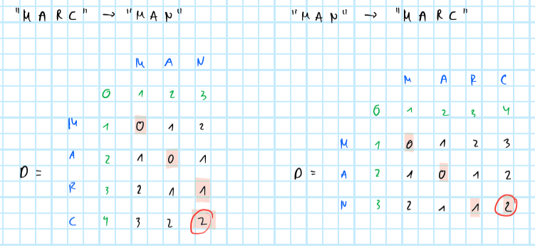
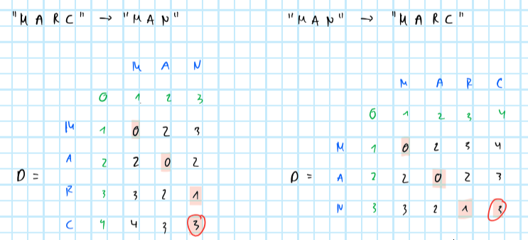

# Inversion

The algorithm we will perform is the powerful *MergeSort*, but in each step of the merging phase we will count the inversions. Taking advantage of the fact that the two arrays $\mathbf{l}$ and $\mathbf{r}$ that we are comparing at each step $k$ are already sorted in non-decreasing order, we have that if $\mathbf{l}_i > \mathbf{r}_j$ then this implies that $\mathbf{l}_i > \mathbf{r}_m$ for all $m > j$.

## Pseudocode

The pseudo-code of this algorithm will consists of two functions, `count_inversions` and `merge_inversion`. The former is the main, recursive function that uses the `merge_inversion` as a sub-method. To understand the pseudo-code let us consider a simple example of a list: `A=[3,1,2,4]`, which has only one inversion. The `count_inversions` function will recursively split `A` into halves until it reaches the $K$-th step when $A_K$ is of length 1. At that point it exits the recursion and simply returns the list $A_K$ itself and a pseudo-inversion count of $0$. At all other steps it returns the output from `merge_inversion(left,right,inv_left,inv_right)` - a list sorted in non-decreasing order and the cumulative count of inversions.

```
def count_inversions(A):
	if len(A) = 1
    	# In case we are already at final divisions:
		return A, 0
	else:
		# For all other steps k<K:
    	middle = len(A)/2 
    	intialize left, right
		for x in A up to middle: 
			add x to left 
		for x in A after middle: 
			add x to right 
		left, inv_left = count_inversions(left) 
		right, inv_right = count_inversions(right) 
		return merge_inversion(left,right,inv_left,inv_right)
```

The `merge_inversion` function implements the $k$-th step logic: *MergeSort* and *counting inversions*. The latter works in the same way it always does, it compares two elements `left[0]` and `right[0]` and appends the output list `combine` by the smaller value. How inversions are counted should be straight-forward to see as well: when comparing `left[0]` and `right[0]` suppose we have `left[0] > right[0]`, so we have encountered an inversion. Then this implies that since `left` is already sorted in non-decreasing order the `inversion` counter should be incremented by the length of `left`.

```
def merge_inversion(left,right,inv_left,inv_right):
	 # Initialize:	
    combine = []
    inversion = 0
    # Merge and count inversions:
    while len(left) != 0 and len(right)!=0:
    	if left[0] > right[0]:
			add right[0] to combine
			add len(left) to inversion
			remove right[0] from right
		else:
			add left[0] to combine
			remove left[0] from left
    endwhile
    # Take care of remaining elements:
    while len(left) != 0:
		add left[0] to combine
		remove left[0] from left
    endwhile
    while len(right) != 0:
		add right[0] to combine
		remove right[0] from right
    endwhile
    # Add them all up:
    total_inversion = inversion + inv_left + inv_right
    return combine, total_inversion
```

## Complexity

Let $T(n)$ the time complexity of the algorithm. Given that *MergeSort* involves splitting the list in then recursively *MergeSort* twice at each recursion we have

$$
\begin{aligned}
&&T(n)&=2T\left(\frac{n}{2}\right) + \mathcal{O}(n)\\
\end{aligned}
$$

where $\mathcal{O}(n)$ corresponds to the complexity of merging the two sub-arrays again. Then we can derive the complexity as follows:

$$
\begin{aligned}
&&T(n)&=2T\left(\frac{n}{2}\right) + \mathcal{O}(n)\\
&& &=2\left[2T\left(\frac{n}{4}\right) + \mathcal{O}(\frac{n}{2}) \right]+ \mathcal{O}(n) \\
&& &= 2^K T\left(\frac{n}{2^K}\right) + \sum_{k=0}^{K-1}2^k \mathcal{O}(\frac{n}{2^k})\\
&& &= n T\left(1\right) + \sum_{k=0}^{K-1}n \mathcal{O}(1)\\
\end{aligned}
$$

Note that $n \mathcal{O}(1)=\mathcal{O}(n)$ and hence

$$
\begin{aligned}
&& T(n)&=k \mathcal{O}(n) = \mathcal{O}(n \log n) \\
\end{aligned}
$$


## Proof of correctness

**Case where $|A| \le 1$:**

In this case it is trivial that the algorithm is corrects since we will jump straight to 

```
if len(A) = 1
	# In case we are already at final divisions:
	return A, 0
```

so the algorithm correctly returns 0.

**General case** 

We will prove by induction. Suppose we are at the $k$-th step of the algorithm and assume that in all previous steps the number of inversions have been computed correctly and list $A_k$ is sorted correctly. At the step $k$ we then split $A_k$ into `left` and `right`. Then we have already demonstrated above how the `merge_inversion` will correctly merge `left` and `right` and increment the `inversion` counter. Applying the principle of mathematical induction we conclude that the algorithm is correct.

## Example 

Below we have sketched a schematic example of how the algorithm works. On the left in black we show the *divide* phase. Individual rows show the $K$ steps we need to divide (and then again to conquer). In blue we have sketched the *conquer* phase. Green annotations show where inversions occure and in red have added a simple iterator that counts the inversions at each step $k$ and the sum of all of them above. 

Note that the bottom row of the *divide* phase is also our first point of action of the *conquer* phase. We compare adjacent lists two each other, all of which have just one elements. Sorting them and counting inversions is very simple. We find two inversions - $3>2$ and $9>7$ - and for each of them we increment the iterator by $+1$.

At the next step we have three lists so we just merge the first two. Here we first compare $2$ - at position $i=0$ - to $1$ at position $m=2$. We find that $2>1$ so we have encountered an inversion. But this time we increment the iterator by $m-i=+2$ since $3$ is also greater than $1$. Once again we also sort the elements we look at. 

It should be straight-forward to see that in the remainder of the divide phase we find no more inversions and that we therefore end up with $4$ inversions in total.

 

# String distance


## Pseudocode

### (a) Simple

```
def edit_distance(str_1, str_2):
	# Initialize a distance matrix:
	m = len(str_1)
	n = len(str_2)
	D = matrix (m x n)
	set each element in D to zero
	optimal_sequence =
	# Set O-th row...
	for i from 1 to m:
		D[i,0] = i
	for j from 1 to n:
		D[0,j] = j
 	# Recursion:
	for j from 1 to n:
		for i from 1 to m:
			if s[i] == t[j]:
				substitution_cost = 0
			else:
				deletion_cost = 1
				insertion_cost = 1
				substitution_cost = 1
			edit_costs = [
				D[i-1,j] + deletion_cost, 			# delete
				D[i,j-1] + insertion_cost, 			# insert
				D[i-1,j-1] + substitution_cost 		# substitute
			]
			D[i,j] = minimum(edit_choices) 
			if minimum(edit_costs) == D[i-1,j-1] + substitution_cost:
				if substitution_cost == 0:
					append optimal_sequence by None
				else:
					append optimal_sequence by "S"
			else if minimum(edit_costs) == D[i-1,j] + deletion_cost:
				append optimal_sequence by "D"
			else:
				append optimal_sequence by "I"
	return D[m,n], optimal_sequence
```

### (b) Increased penalty for delete/insert

```
def edit_distance(str_1, str_2):
	# Initialize:
	m = len(str_1)
	n = len(str_2)
	D = matrix (m x n)
	set each element in D to zero
	# Set O-th row...
	for i from 1 to m:
		D[i,0] = i
	for j from 1 to n:
		D[0,j] = j
 	# Recursion:
	for j from 1 to n:
		for i from 1 to m:
			if s[i] == t[j]:
				substitution_cost = 0
			else:
				deletion_cost = 2
				insertion_cost = 2
				substitution_cost = 1
			edit_costs = [
				D[i-1,j] + deletion_cost, 			# delete
				D[i,j-1] + insertion_cost, 			# insert
				D[i-1,j-1] + substitution_cost 		# substitute
			]
			D[i,j] = minimum(edit_choices) 
			if minimum(edit_costs) == D[i-1,j-1] + substitution_cost:
				if substitution_cost == 0:
					append optimal_sequence by None
				else:
					append optimal_sequence by "S"
			else if minimum(edit_costs) == D[i-1,j] + deletion_cost:
				append optimal_sequence by "D"
			else:
				append optimal_sequence by "I"
	return D[m,n], optimal_sequence
```

## Example





## Complexity

Note that here we are looking at nested loop where the $j$-loop requires $n$ operations - one for each column - and the $i$-loop requires $m$ operations - one for each row. Hence the total complexity is of order $\mathcal{O}(nm)$.

## Proof of correctness

Consider:
1. the problem of converting string A to string B with minimum edits.
2. the problem of converting substring A[:i] to substring B[:j] with minimum edits.

As indicated above, let i, j be the i'th and j'th position of A and B, respectively.
Considering the trivial cases where (i=0, j>0) or (i>0, j=0) we find the trivial solutions by simply inserting
all j>0 characters and deleting all i>0 characters, respectively. The strategies for these 2 cases are optimal,
as they are the only options in these situations.
If we can find a way to arrive from any optimal sub-problem (i,j) to one of these trivial cases 
by always choosing the optimal sub-step in between, we have proven optimality.
Therefore, let's consider the case (i,j): There are always only 3 ways to have arrived at (i,j), 
From (i-1,j), (i,j-1), or (i-1,j-1). We can assume optimality at (i,j) by assuming optimality for all
these 3 potential paths and performing the optimal step (the one that minimizes the edit costs)
to arrive at (i,j).
Applying the same logic to the sub-problems' sub-problems, etc., we inevitably arrive at one
of the trivially
optimal cases introduced above. (Keep in mind that when moving back from (i,j) to 
the cost-minimizing
sub-problem we always go either up in the matrix, 
left in the matrix, or up and left in the matrix, 
so in each step backwards at least one of the indices
i, j is reduced by 1, but never by more than 1)
